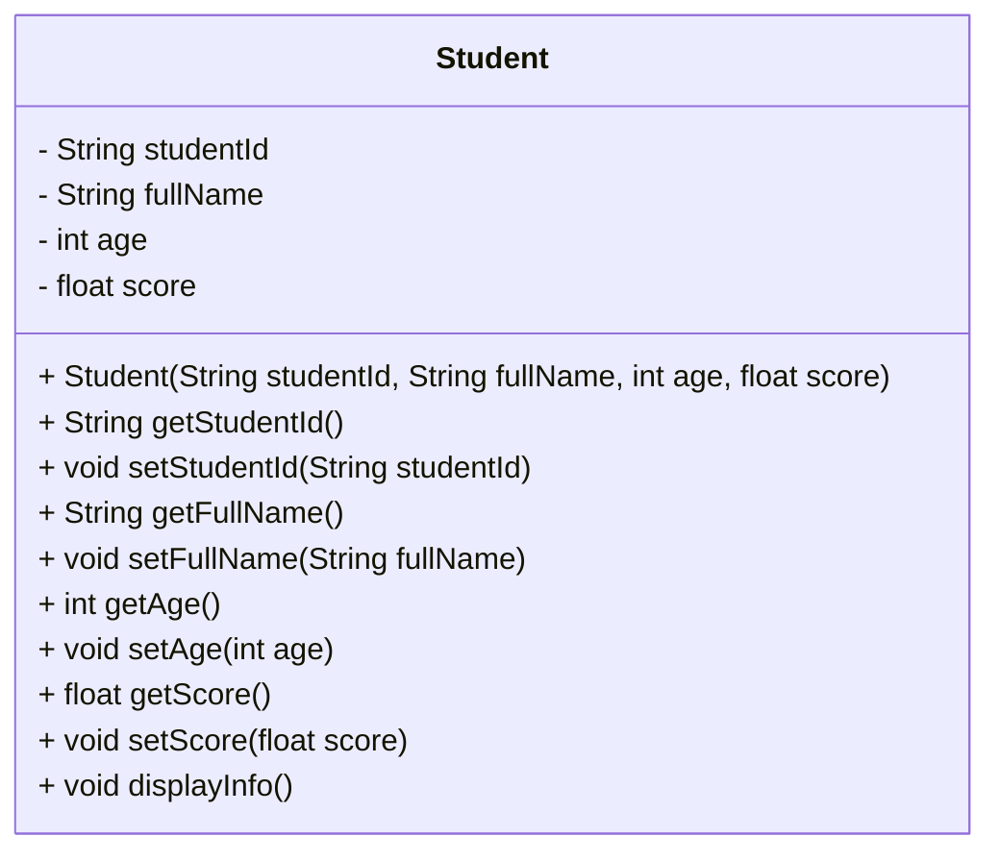

# BÁO CÁO BÀI TẬP: THIẾT KẾ ĐÓNG GÓI LỚP HỌC VIÊN (SESSION 7 - RIKKEILEARN)

> 👤 **Học viên:** Đỗ Hoàng Sơn | **Mã SV:** PTIT-HCM-066
> 🏫 **Môn học:** IT105-K25-Phan-tich-thi-t-k-h-th-ng

---

## 📊 Sơ đồ thiết kế hệ thống (Class Diagram)

> 💡 *Sơ đồ dưới đây được render tự động trực tiếp trên GitHub bằng Mermaid. Bạn cũng có thể tải file **`bt2.drawio`** trong repository này để mở và chỉnh sửa trực tiếp trên [Draw.io (diagrams.net)](https://app.diagrams.net).* 

---

## Nhiệm vụ 1: Cập nhật sơ đồ Class Diagram

Trong bản thiết kế sơ bộ ban đầu của hệ thống RikkeiLearn, các thuộc tính của lớp 'Student' đang để ở trạng thái mặc định hoặc thiếu bảo mật, cho phép các module bên ngoài truy cập và thay đổi trực tiếp dữ liệu điểm số mà không qua kiểm duyệt. Điều này tạo ra rủi ro lớn về tính toàn vẹn dữ liệu điểm số của học viên.

Để khắc phục, tôi đã tiến hành đóng gói (encapsulation) lớp 'Student' bằng cách chuyển toàn bộ thuộc tính sang chế độ private (ký hiệu dấu '-') để ngăn chặn truy cập trực tiếp từ bên ngoài. Đồng thời, các phương thức getter và setter được cấu hình ở chế độ public (ký hiệu dấu '+') nhằm tạo ra kênh giao tiếp an toàn, chuẩn mực giữa các đối tượng.

- Thuộc tính private (-): studentId, fullName, age, score
- Phương thức public (+): Các hàm khởi tạo constructor, getter, setter và phương thức hiển thị thông tin
- Đảm bảo nguyên tắc che giấu thông tin (Information Hiding) trong lập trình hướng đối tượng

## Nhiệm vụ 2: Mô tả logic xử lý an toàn trong phương thức setScore()

Để giải quyết triệt để bài toán bẫy dữ liệu (Edge Cases) khi người dùng hoặc hệ thống cố tình gán điểm âm hoặc điểm lớn hơn 10, phương thức 'setScore()' được bổ sung logic kiểm tra điều kiện nghiêm ngặt.

Nếu giá trị đầu vào nằm trong khoảng từ 0 đến 10, hệ thống sẽ cho phép cập nhật. Ngược lại, nếu điểm số vi phạm dải giá trị cho phép, hệ thống sẽ lập tức từ chối gán và đưa ra thông báo lỗi.

- Điều kiện kiểm tra: if (score >= 0.0 && score <= 10.0)
- Trường hợp hợp lệ: Gán giá trị mới cho thuộc tính this.score
- Trường hợp vi phạm: In ra màn hình dòng thông báo lỗi 'Điểm số không hợp lệ. Phải nằm trong khoảng từ 0 đến 10' và giữ nguyên giá trị cũ

## Bảng đặc tả cấu trúc lớp Student

Dưới đây là bảng chi tiết các thành phần cấu tạo nên lớp 'Student' sau khi đã chuẩn hóa bổ từ truy cập:

| Thành phần | Tên định danh | Bổ từ truy cập | Kiểu dữ liệu | Mô tả chi tiết & Ràng buộc |
| --- | --- | --- | --- | --- |
| Thuộc tính | studentId | Private (-) | String | Mã định danh học viên, duy nhất |
| Thuộc tính | fullName | Private (-) | String | Họ và tên đầy đủ của học viên |
| Thuộc tính | age | Private (-) | int | Tuổi học viên, giá trị nguyên dương |
| Thuộc tính | score | Private (-) | float | Điểm trung bình, ràng buộc từ 0.0 đến 10.0 |
| Phương thức | setScore | Public (+) | void | Nhận tham số score, kiểm tra điều kiện trước khi gán |
| Phương thức | getScore | Public (+) | float | Trả về giá trị điểm số hiện tại của học viên |

## Kết luận và Hướng dẫn thực thi

Bài tập đã hoàn thành việc áp dụng tính đóng gói (Encapsulation) - một trong bốn trụ cột của Lập trình hướng đối tượng. Việc sử dụng bổ từ private kết hợp với kiểm tra logic trong setter giúp hệ thống RikkeiLearn loại bỏ hoàn toàn các lỗ hổng thay đổi điểm trái phép.

Mã nguồn cài đặt bằng ngôn ngữ Java được đính kèm bên dưới để giảng viên chấm điểm trực tiếp.

---

## 📁 Danh sách tệp tin nộp bài trong Repository
- 📝 `bt2.docx`: Báo cáo tài liệu phân tích nghiệp vụ hoàn chỉnh.
- 🎨 `bt2.drawio`: File thiết kế sơ đồ chuẩn theo quy định đề bài (mở trực tiếp bằng [Draw.io](https://app.diagrams.net) hoặc Lucidchart).
- 💻 `Student.java`: Mã nguồn chương trình.
